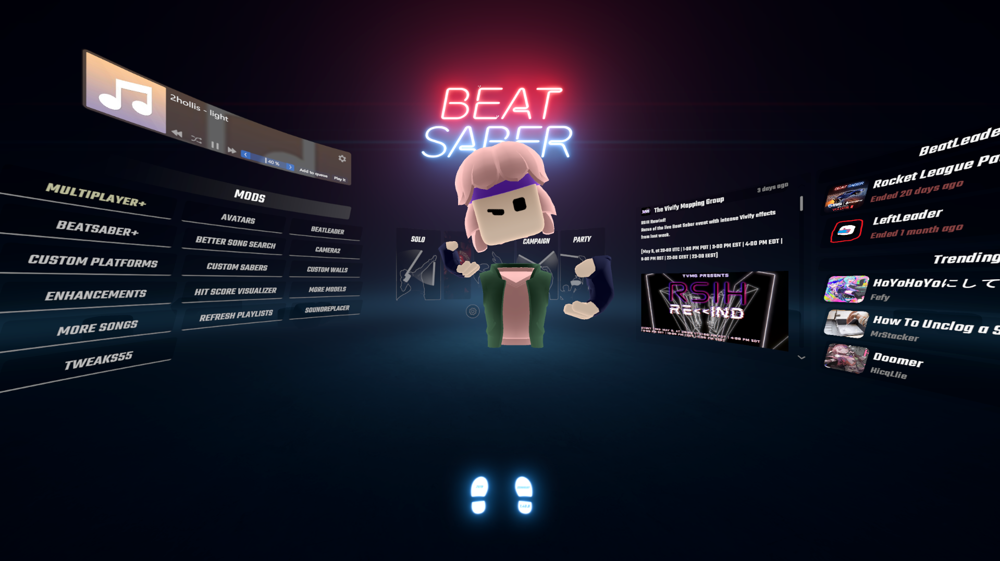

# BetterBSAvatar

BetterBSAvatar is a PC Beat Saber mod that displays the game's built-in multiplayer avatar in menus and single-player gameplay.

## Features

- Creates and displays your built-in Beat Saber multiplayer avatar outside multiplayer lobbies.
- Tracks the avatar to your headset and hand/controller positions.
- Updates the avatar after changes are applied in Beat Saber's avatar editor.
- Provides an option to hide the avatar from the first-person headset view for normal play or third-person camera setups.

## Requirements And Platform

- Beat Saber 1.40.8 on PC.
- BSIPA 4.3.6 or a compatible 4.x version.
- BeatSaberMarkupLanguage 1.12.5 or a compatible 1.x version.
- Windows PCVR only.

Standalone Quest/Android builds are not supported.

## Installation

1. Install BSIPA and BeatSaberMarkupLanguage for Beat Saber 1.40.8.
2. Download the latest `BetterBSAvatar-vX.Y.Z.zip` release.
3. Extract the zip into your Beat Saber install folder so `BetterBSAvatar.dll` lands in `Plugins`.
4. Launch Beat Saber.
5. Open `Mod Settings > BetterBSAvatar`.

## Settings

- `Enable Avatar`: creates, displays, tracks, and refreshes the avatar.
- `Show in First Person`: shows the avatar in the headset view. Disable this if you only want the avatar visible to third-person camera setups.

## Patch Notes

See [PATCH_NOTES.md](PATCH_NOTES.md).

## License

BetterBSAvatar is licensed under the MIT License. See `LICENSE` for details.
